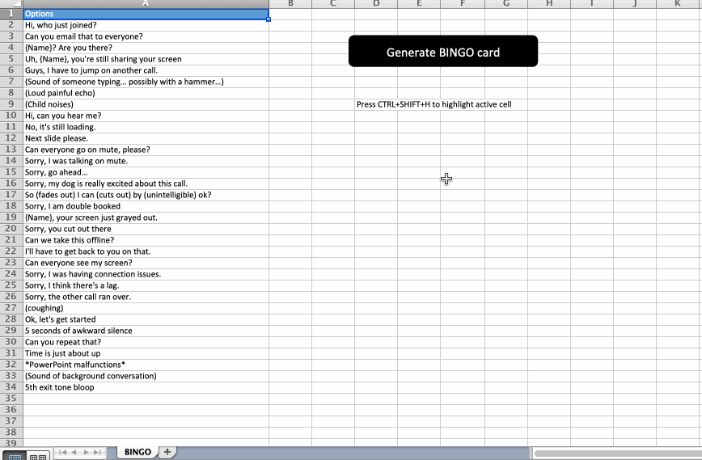

# bingo
Simple Excel-based Bingo card randomizer for conference calls

## Description
An Excel workbook with a few macros to randomly generate a bingo card. New items can be appended to the options list. Download and enjoy!

Options in worbook were selected from some conference call bingo memes.

Update: Apparently MAC does not have a Dictionary object which weird. MAC safe versions thanks to this library https://github.com/VBA-tools/VBA-Dictionary.

